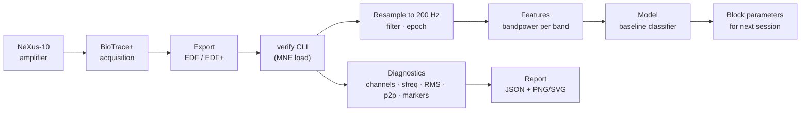
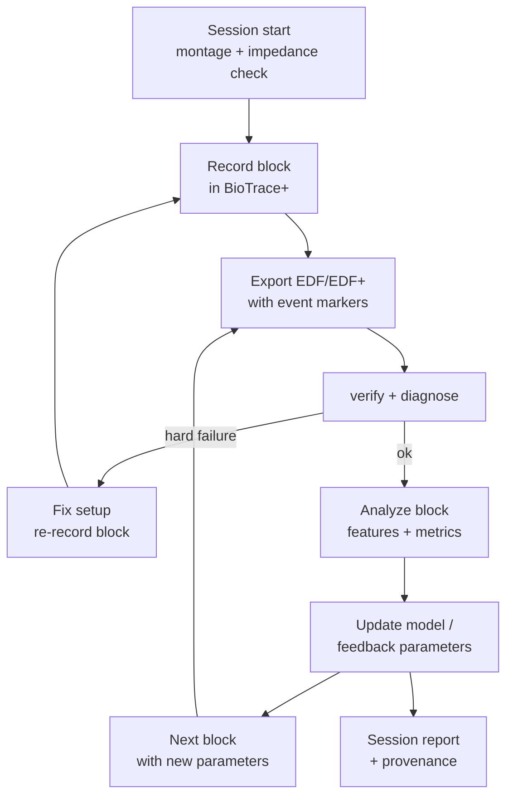

# NeXus NeuroMirror

A clean starter for a **four-channel EEG neurofeedback prototype** built on the
original **Mind Media NeXus-10** amplifier with **BioTrace+** acquisition, plus
an offline-first AI adaptation loop. The repository ships a montage, a phased
workflow, and a diagnostic verifier that turns a raw EDF/EDF+ export into a
machine-readable report and a small set of clear figures.

> **Safety & research disclaimer.** This is a **research / educational
> prototype**, not a medical device. It is **not** intended to diagnose, treat,
> cure, or prevent any disease, and it makes no clinical claims. Use only on
> yourself or consenting research participants under an appropriate protocol,
> and always follow the manufacturer's documentation for hardware operation,
> electrode application, reference, and **ground placement**. Neurofeedback can
> cause fatigue, headache, or discomfort; stop if that occurs.

## Why offline-first

No public, confirmed **real-time SDK** exists for this legacy NeXus-10 setup.
The design is therefore **offline-first with blockwise adaptation**: you record
a block in BioTrace+, export to EDF/EDF+, analyze/adapt between blocks, and feed
updated parameters into the next block. A clean extension path for a future
real-time SDK is described in [`docs/architecture.md`](docs/architecture.md).

## Initial four-channel montage

| Site | Role | Rationale |
|------|------|-----------|
| **Fz**  | EEG | Midline frontal — attention, frontal theta, executive control |
| **FCz** | EEG | Fronto-central — sensorimotor / error-related activity |
| **Pz**  | EEG | Midline parietal — P300, alpha, attention allocation |
| **Oz**  | EEG | Midline occipital — visual alpha (eyes open/closed contrast) |

- **Reference:** linked ears / mastoids (**A1+A2**, equivalently M1+M2), kept
  identical across every session.
- **Ground:** **manufacturer-approved placement only** — follow the Mind Media
  NeXus-10 / BioTrace+ manual for your hardware revision. Do not improvise.
- **Impedance / signal quality:** follow the BioTrace+ / Mind Media
  signal-quality guidance for your hardware and electrode type, and balance
  impedances across channels. (No official NeXus-10 impedance limit is cited
  here, so no fixed threshold is asserted.)

Full definition: [`configs/montage.yaml`](configs/montage.yaml).

## Acquisition-to-model pipeline



## Blockwise closed-loop workflow



## Quick start

```bash
# 1. Install (Python >= 3.10)
python -m venv .venv && source .venv/bin/activate
make install-dev            # or: pip install -e ".[dev]"

# 2. Generate a synthetic EDF and run the verifier end-to-end
make demo

# 3. Verify a real BioTrace+ export
nexus-neuromirror verify path/to/session.edf \
    --config configs/project.example.yaml \
    --out reports/diagnostic
```

The verifier:

- loads EDF/EDF+ through **MNE**,
- reports channel names, sample rate, duration, unit assumptions, and
  per-channel **RMS** / **peak-to-peak**,
- detects **EDF+ annotations** and likely **marker channels**,
- validates the four expected EEG channels using **configurable aliases**,
- writes a machine-readable `diagnostic.json` plus **PNG/SVG** figures
  (multichannel trace, PSD, marker timeline),
- **exits nonzero** on a hard validation failure (missing channel, too short,
  disallowed sample rate, missing required events).

## Web dashboard (`web/`)

A local, single-user **web dashboard** wraps the same verifier so you can upload
BioTrace+ exports through a browser, view diagnostics, and (optionally) commit
raw recordings plus generated reports to this private repository. It is a
**private prototype** — there are no user accounts; access is controlled entirely
by the authenticated preview/hosting boundary you run it behind.

> **Not a medical or diagnostic tool.** The dashboard surfaces the same research
> diagnostics as the CLI and makes no clinical claims.

### Architecture

- **Backend** — FastAPI (`web/backend/nnm_web/`) that reuses the
  `nexus_neuromirror` package for EDF analysis. Endpoints: health/status,
  session catalog, session detail, secure multipart upload, artifact serving,
  and repo-sync status.
- **Frontend** — React + Vite + TypeScript + Tailwind (`web/frontend/`),
  hash-routed, with Overview, Upload, Sessions, and Session-detail pages,
  light/dark themes, and full skeleton/empty/error/unsupported-format states.

### Accepted upload formats

| Format | Extensions | Handling |
|--------|-----------|----------|
| EDF / EDF+ | `.edf` | **Analyzed** with the MNE verifier → report + figures |
| ASCII / CSV | `.csv`, `.txt`, `.asc` | Cataloged only (checksum + metadata) in the MVP |
| MATLAB | `.mat` | Cataloged only (checksum + metadata) in the MVP |
| BCD | `.bcd` | **Archival only — never parsed** |

### Privacy & security model

- EEG/neurofeedback data is sensitive. Uploads are stored **in this repository**
  and, when git sync is enabled, committed and pushed to the **private** GitHub
  remote. Sharing the running site grants upload access — keep it behind an
  authenticated boundary.
- Every upload is **sanitized** (path-traversal rejected, filename normalized),
  **extension-restricted**, **size-limited**, and **SHA-256 checksummed**. Raw
  file contents are **never logged**.
- The `.gitignore` keeps all real recordings and generated reports out of the
  repo. Accepted uploads are added only through an explicit, **per-file safe
  force-add** in the upload path — the data directories are never broadly
  un-ignored. The only intentionally committed report is the **synthetic** demo
  under `reports/diagnostic_demo/`, which powers the Overview page.

### 8 MB upload limit

The hosted preview proxy rejects requests over 10 MB, so the dashboard caps
uploads at **8 MB** (`NNM_MAX_UPLOAD_BYTES`). A 60-second four-channel synthetic
EDF is ~150 KB, well within range. For larger real recordings, use the CLI
directly.

### GitHub sync & runtime credentials

Repo sync uses server-side `git`/`gh` only — **GitHub credentials are never
exposed to the frontend**. If credentials are missing or a push fails, the
upload is still saved and cataloged locally and the failure is surfaced in the
UI without data loss. When running behind a hosted preview, git credentials must
be injected into the **server** environment at runtime; they may not persist
across a hosted session, in which case sync degrades gracefully to local-only.

### Run it locally

```bash
# Backend (from repo root, with the project venv active)
pip install -r web/backend/requirements.txt
cd web/backend && PYTHONPATH=. uvicorn nnm_web.app:app --port 8000

# Frontend (separate terminal)
cd web/frontend && npm install && npm run dev   # dev server proxies /api -> :8000
```

For a single-process deployment, build the frontend (`npm run build`) — the
backend serves `web/frontend/dist/` at `/` automatically when present.

Useful environment variables: `NNM_GIT_SYNC_ENABLED` (default on),
`NNM_GIT_REMOTE`, `NNM_GIT_BRANCH`, `NNM_MAX_UPLOAD_BYTES`, `NNM_UPLOADS_SUBDIR`,
`NNM_REPORTS_SUBDIR`, `NNM_CONFIG_PATH`, `NNM_REPO_ROOT`.

Tests: `cd web/backend && python -m pytest` (backend);
`cd web/frontend && npm run typecheck && npm run lint && npm run build`
(frontend). See [`web/README.md`](web/README.md) for details.

## Success criteria (prototype)

1. A 60-second bring-up recording exports to EDF/EDF+ with all four channels.
2. `nexus-neuromirror verify` passes with **no hard failures**.
3. Per-channel RMS falls in a plausible band (~0.5–150 µV) with no dead leads.
4. Event markers round-trip from BioTrace+ into annotations or a marker channel.
5. Occipital **Oz** shows a visible eyes-closed alpha increase in the PSD.
6. Reports are reproducible and contain no personally identifying information.

## Repository layout

```
configs/     montage.yaml, project.example.yaml
docs/        setup-checklist.md, architecture.md
src/         nexus_neuromirror/ (config, edf, metrics, markers, verify, viz, report, cli)
tests/       synthetic-EDF based tests (no private data required)
web/         FastAPI backend + React/Vite dashboard — see web/README.md
data/        (git-ignored) recordings — see data/README.md
reports/     (git-ignored) generated diagnostics — see reports/README.md
             (exception: synthetic reports/diagnostic_demo/ is committed)
```

## Documentation

- [`docs/setup-checklist.md`](docs/setup-checklist.md) — hardware/software
  inventory, NeXus-10 bring-up, BioTrace+ configuration, 60 s diagnostic,
  EDF/EDF+ export, marker verification, data-governance checklist.
- [`docs/architecture.md`](docs/architecture.md) — clean-architecture narrative
  with component, sequence, and data-flow diagrams; offline/blockwise rationale;
  real-time SDK extension path.
- [`data/README.md`](data/README.md) and [`reports/README.md`](reports/README.md)
  — why neural data and generated reports must not be committed.

## External resources & datasets

These support development, benchmarking, and model prototyping. NeXus-10 links
are for **manuals and export documentation only** — no real-time SDK is implied.

- Mind Media — BioTrace+ software & NeXus manuals / data export:
  <https://www.mindmedia.com/en/support/downloads/> and
  <https://www.mindmedia.com/en/products/biotrace-software/>
- Brain Invaders adaptive vs. non-adaptive P300 dataset (Zenodo):
  <https://zenodo.org/records/2669187>
- PhysioNet EEG Motor Movement/Imagery Dataset (EEGMMIDB):
  <https://physionet.org/content/eegmmidb/1.0.0/>
- CBraMod (EEG foundation model, code):
  <https://github.com/wjq-learning/CBraMod>
- REVE (EEG model on Hugging Face):
  <https://huggingface.co/brain-bzh/reve-base>
- MNE-Python (EDF/EDF+ IO and analysis):
  <https://mne.tools/stable/index.html>
- EDF / EDF+ format specification:
  <https://www.edfplus.info/specs/index.html>

## License

MIT — see [`LICENSE`](LICENSE).
