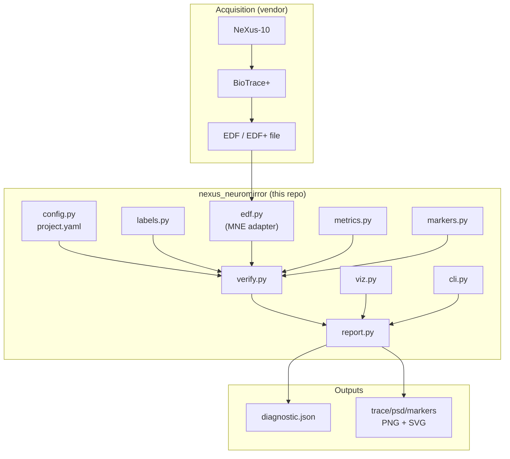
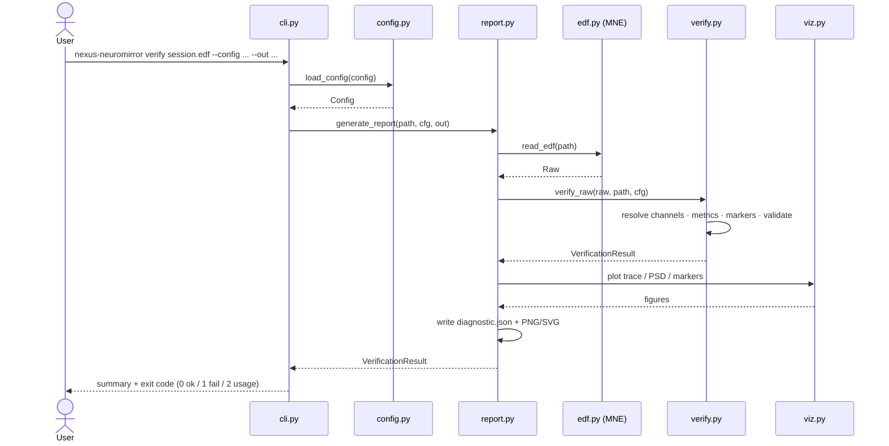
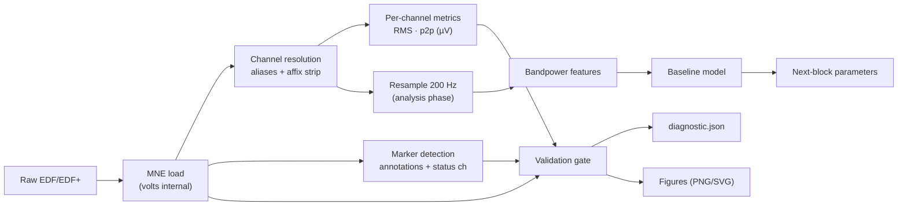
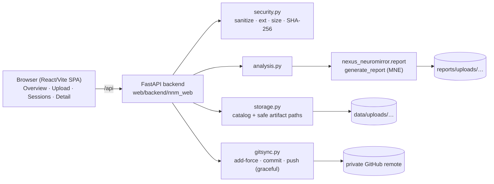

# Architecture

NeXus NeuroMirror is deliberately small and **offline-first**. It treats a
BioTrace+ EDF/EDF+ export as the system boundary, verifies and analyzes it, and
produces artifacts that inform the *next* recording block. This document
explains the design, its rationale, and how it would extend to a future
real-time SDK.

## Design principles

1. **Offline-first / blockwise.** No public, confirmed real-time SDK exists for
   this legacy NeXus-10 setup, so the loop is closed *between blocks*, not
   sample-by-sample. Each block is recorded, exported, verified, analyzed, and
   used to update parameters for the following block.
2. **Boundary at the file.** The rest of the system depends only on an MNE
   `Raw` object loaded from EDF/EDF+. This isolates vendor specifics to one
   thin adapter and keeps analysis reproducible.
3. **Config over code.** Channel names, aliases, sample rates, marker names,
   validation thresholds, and model options live in YAML
   ([`configs/project.example.yaml`](../configs/project.example.yaml)), so a new
   montage or export convention rarely requires code changes.
4. **Fail loud on hard problems, warn on soft ones.** The verifier separates
   *hard failures* (nonzero exit) from *warnings*, serving both a strict CI gate
   and exploratory bring-up.
5. **No neural data or reports in git.** See
   [`data/README.md`](../data/README.md) and
   [`reports/README.md`](../reports/README.md).

## Module map

| Module | Responsibility |
|--------|----------------|
| `config.py`  | Load & validate the project YAML into typed dataclasses |
| `labels.py`  | Normalize labels; alias/affix-aware channel & marker matching |
| `edf.py`     | Adapter: read EDF/EDF+ via MNE; extract compact metadata |
| `metrics.py` | Per-channel RMS / peak-to-peak / max / mean (in µV) |
| `markers.py` | Detect EDF+ annotations and candidate marker channels |
| `verify.py`  | Orchestrate diagnostics + apply the validation gate |
| `viz.py`     | Accessible matplotlib figures (trace, PSD, marker timeline) |
| `report.py`  | Read once, verify, render figures, write `diagnostic.json` |
| `cli.py`     | `nexus-neuromirror verify ...`; exit codes 0/1/2 |
| `synth.py`   | Synthetic `RawArray` / EDF for demos and tests |

## Component diagram

## Sequence: `verify` command

## Data-flow diagram

The dashed portion of the pipeline (resample → features → model → next-block
parameters) is where **blockwise adaptation** lives. The verifier covers the
solid path today; the analysis/model modules plug into the same `Raw`/config
contract as they are built out.

## Why not real-time?

BioTrace+ is primarily a recording/feedback application, and there is **no
publicly confirmed real-time streaming SDK** for this NeXus-10 generation that
we can depend on. Rather than assert one exists, the architecture:

- closes the loop **between blocks** (record → export → adapt → next block), and
- keeps every dependency on vendor behavior inside `edf.py`.

## Extension path: future real-time SDK

If/when a supported real-time interface becomes available, integration is a
localized change:

1. **Add a streaming adapter** alongside `edf.py` (e.g. `stream.py`) that yields
   the same in-memory representation (channels × samples, sfreq, markers) the
   rest of the code already consumes.
2. **Reuse the contracts.** `labels.py`, `metrics.py`, `markers.py`, and the
   feature/model layer operate on arrays + config, not on files, so they carry
   over unchanged.
3. **Introduce a windowing scheduler** (the `model.window_s` / `window_overlap`
   options already exist in config) to run features/inference on rolling
   buffers.
4. **Swap the "next-block parameters" sink** for a live feedback sink; the
   validation gate becomes a per-window quality monitor.
5. **Keep offline as the source of truth** for calibration and evaluation so
   real-time behavior stays reproducible and auditable.

No code in the current modules assumes files-only I/O beyond `edf.py` and
`report.py`, which is what makes this path low-risk.

## Web dashboard layer (`web/`)

The web dashboard is a thin delivery layer over the existing package — it adds a
UI and an upload/sync workflow without changing the analysis contracts.

**Design principles**

- **Reuse, don't fork.** EDF analysis flows through `report.generate_report`; the
  backend never re-implements signal logic. The dashboard is one more consumer
  of the same array/config contracts described above.
- **Security at the boundary.** All untrusted input (filenames, sizes,
  extensions, artifact paths) is validated in `security.py` / `storage.py`.
  Path-traversal is rejected on both upload naming and artifact serving. Raw
  file contents are never logged.
- **Fail-safe sync.** `gitsync.py` performs a per-file `git add --force` for the
  specific accepted upload and its report only, so the data-directory ignore
  rules stay intact. A missing-credential or push failure preserves the local
  upload and is surfaced to the UI rather than raised.
- **Single-user trust model.** There are no accounts; the private authenticated
  preview/hosting boundary is the access control. This is acceptable for a
  single-user prototype and is documented as a limitation.

**Deployment note.** For the hosted preview, keep uploads under the proxy's
10 MB request limit (the app caps at 8 MB). GitHub credentials must be injected
into the server environment at runtime; if they are unavailable, sync degrades
gracefully to local-only without data loss.
